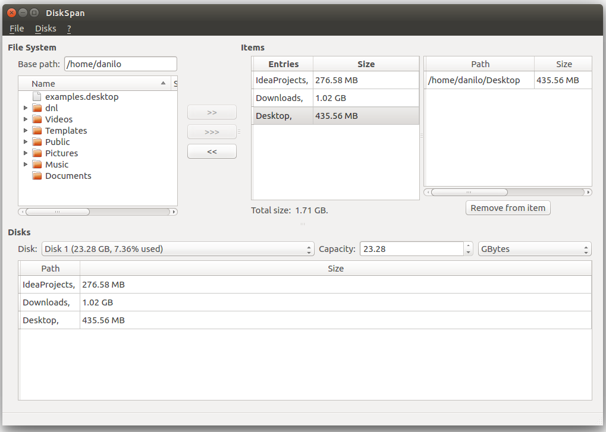

# Prerequisites
Qt >= 5.5

# Screenshot

# How to build
## Unix (g++)
qmake

make

## Windows (msvc)
Open VS command prompt.

qmake

nmake -f Makefile

# Troubleshooting
## Windows

## Unix
### Failed to find "GL/gl.h" in "/usr/include/libdrm"
sudo apt-get install mesa-common-dev

### /usr/bin/ld: cannot find -lGL
sudo apt-get install libglu1-mesa-dev

## License

[GNU LGPL license](http://www.gnu.org/licenses/lgpl-3.0.html)
